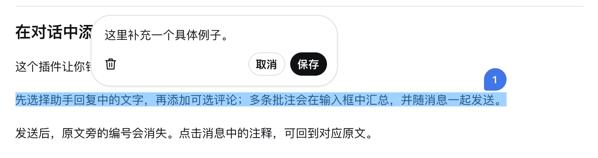
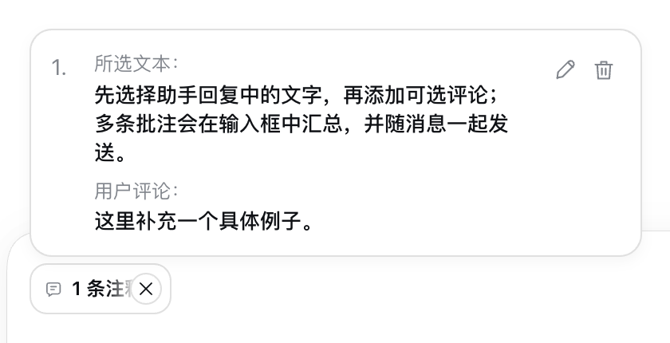
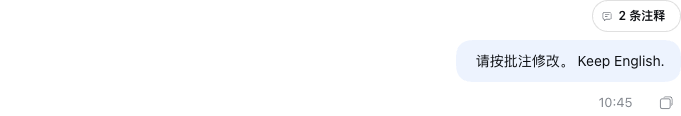
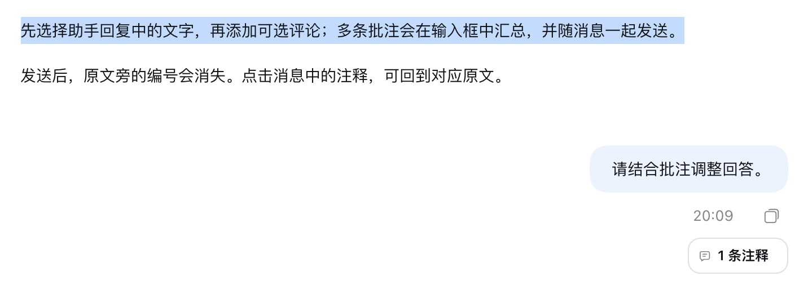

# DSH Codex Annotations

DeepSeek Harness 的 Codex 风格批注插件：选择助手原文、添加评论，随消息一起发送。

## 效果

| 场景 | 展示 |
| --- | --- |
| 添加批注 |  |
| 编辑评论 |  |
| 查看批注 |  |
| 随消息发送 |  |
| 仅发送批注 |  |
| 发送后跳转 |  |

## 安装

适用于 **DSH Desktop / Web 0.2.0-rc.2**，当前版本 **0.2.10**。

```sh
dsh plugin --profile desktop add 'github:deepseek-harness-plugins/dsh-codex-annotations#main'
```

安装后重新打开 DSH。Web 用户将 `desktop` 换成 `web`；macOS 未配置 `dsh` 命令时，使用 `/Applications/DeepSeek Harness.app/Contents/Resources/runtime/cli/bin/dsh`。

## 使用

1. 选择助手回复中的文字，点击「添加到对话」。
2. 评论可以留空；点击「保存」或按 Enter 保存，Shift+Enter 换行。
3. 在聊天框输入要求，使用原生发送按钮或 Enter 发送。

悬停「N 条注释」查看、编辑或删除批注；点击原文可跳转。× 直接删除全部待发送批注。删除后新增批注会复用空缺编号。

批注按会话保存，也可单独发送。已发送批注入口位于消息气泡上方，只有批注时保留顶部留白；点击后高亮原文，点击别处即消失。

模型只收到批注编号、完整原文和评论；定位信息保存在会话中，用于回显和跳转。

## 开发

Node.js 24+：

```sh
npm ci
npm run check
npm run test:host
```

`test:host` 使用隔离配置和本地测试模型。更多细节见 [验证记录](docs/verification.md) 和 [UI 对照](docs/ui-comparison.md)。

[MIT License](LICENSE)
