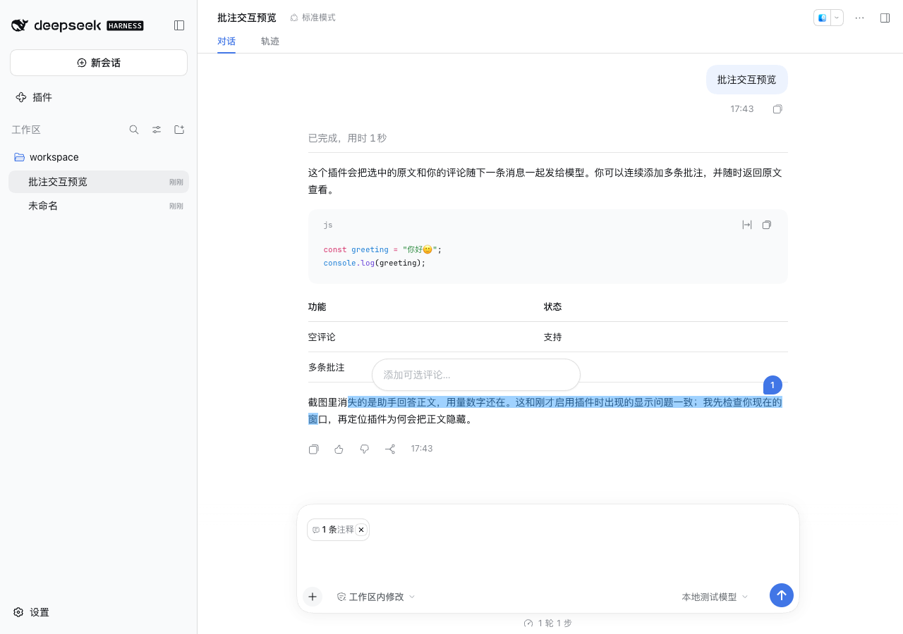
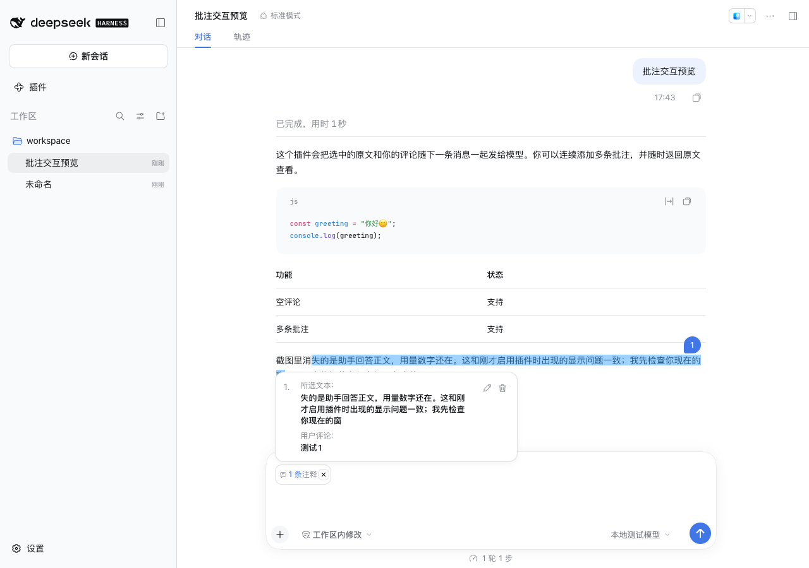

# UI 三态对照

2026-10-08，版本 0.2.0。参考为用户本轮提供的三张 Codex 截图：划选后的紧凑框、展开编辑框，以及聊天框胶囊和详情卡。

## 对照方法

参考图分别为 908×328、902×390、888×422 个实际像素。按 2x 截图推定；轮廓人工定位约有 ±1 个实际像素误差，无法由图片确认 Codex 原始 CSS 或系统缩放设置。dsh 采用 Chrome `deviceScaleFactor: 2` 原生渲染；裁切控件后对齐左上角，逐像素计算 RGB 最大通道绝对差，无图片缩放。差值包含字形、光标闪烁帧、图标、主题色、描边和阴影，不能换算成整体功能相似度。

| 部分 | Codex 参考实际像素 | dsh 实测布局尺寸 | 对齐结果 |
| --- | --- | --- | --- |
| 紧凑输入框 | 592×92 | 296×46 | 外框尺寸一致；立即获得输入焦点 |
| 展开编辑框 | 592×172 | 296×86 | 外框尺寸一致；删除、取消、保存的布局对应 |
| 聊天框详情卡 | 768×286 | 384×143 | 同原文与「测试1」评论时尺寸一致 |
| 聊天框胶囊 | 178×64 | 89.14×32 | 宽差 0.14 布局像素；文字完整显示 |
| 蓝色编号 | 54×54 | 27×27 | 尺寸一致；多行时置于首行右端上方 |
| 胶囊与详情卡 | 同左边缘；间隔约 8 实际像素 | 同左边缘；间隔 4 布局像素 | 对齐一致 |

详情卡会按完整原文和评论自适应高度，上表 143 不是对长文本强制截断。展开编辑框也会随评论增长。

## 三种状态的行为

1. 选择助手文本，点击「添加到对话」后显示紧凑输入框、蓝色编号与原文高亮。点击框内或开始输入，展开操作栏。
2. 点击「保存」或 Enter 提交修改，Shift+Enter 换行。取消、Escape、点击外部保留原有评论；删除同时移除原文编号。
3. 输入框内显示单个「N 条注释」胶囊。点击打开详情卡，包含编号、所选文本、用户评论、铅笔和删除图标。铅笔返回原文编辑；点击引用定位原文。发送后的消息显示同类胶囊及只读详情卡。

紧凑框取代旧版完成按钮；展开框取代自动保存；输入框内部胶囊和浮动详情卡取代输入框外的多重列表。原生图片、文件、正文和发送路径仍由 dsh 管理。

## 保留的 dsh 风格差异

采用 dsh 原生字体、文字色、边框和面板背景；编号主题蓝色实测 `#4176E6`，Codex 参考约为 `#3A83F7`。深色背景实测 `#2C2C2E`。按用户要求省略麦克风，不以其他按钮占位。截图中的光标帧与字体抗锯齿不保证完全一致。

底层原生批注引用保留用于编码发送，其视觉节点由自定义胶囊呈现；不删除原文、评论或模型资料。此对照限于截图可确认的状态，不声明 Codex 的全部行为一致。

## 复现与证据

执行 `npm run test:host` 生成 `artifacts/ui-measurements.json`、`pixel-*@2x.png` 及流程截图。安装 Pillow、numpy 后执行：

```sh
python3 scripts/compare-ui.py compact.png expanded.png composer.png
```

生成的 `artifacts/UI三态像素对比.png` 与 `pixel-differences-v2.json` 保留原倍率逐像素差值。参考原图和本地差值图不进入 Git 或安装包。





