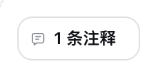
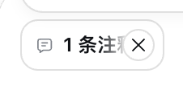

# UI 三态对照

2026-10-09，版本 0.2.10。参考为用户提供的三张 Codex 截图：划选后的紧凑框、展开编辑框，以及聊天框胶囊和详情卡；胶囊默认态、已发送状态及消息布局另参考随后提供的截图。

## 对照方法

参考图分别为 908×328、902×390、888×422 个实际像素。按 2x 截图推定；轮廓人工定位约有 ±1 个实际像素误差，无法由图片确认 Codex 原始 CSS 或系统缩放设置。dsh 采用 Chrome `deviceScaleFactor: 2` 原生渲染；裁切控件后对齐左上角，逐像素计算 RGB 最大通道绝对差，无图片缩放。差值包含字形、光标闪烁帧、图标、主题色、描边和阴影，不能换算成整体功能相似度。

| 部分 | Codex 参考实际像素 | dsh 实测布局尺寸 | 对齐结果 |
| --- | --- | --- | --- |
| 紧凑输入框 | 592×92 | 296×46 | 外框尺寸一致；立即获得输入焦点 |
| 展开编辑框 | 592×172 | 296×86 | 外框尺寸一致；删除、取消、保存的布局对应 |
| 聊天框详情卡 | 768×286 | 384×143 | 同原文与「测试1」评论时尺寸一致 |
| 聊天框胶囊 | 178×64 | 89×32 | 外框尺寸一致；默认态文字完整显示 |
| 蓝色编号 | 54×54 | 27×27 | 尺寸一致；多行时置于首行右端上方 |
| 胶囊与详情卡 | 同左边缘；间隔约 8 实际像素 | 同左边缘；间隔 4 布局像素 | 对齐一致 |

详情卡会按完整原文和评论自适应高度，上表 143 不是对长文本强制截断。展开编辑框也会随评论增长。

## 三种状态的行为

1. 选择助手文本，点击「添加到对话」后显示紧凑输入框、蓝色编号与原文高亮。点击框内或开始输入，展开操作栏。
2. 点击「保存」或 Enter 提交修改，Shift+Enter 换行。取消、Escape、点击外部保留原有评论；删除同时移除原文编号。
3. 输入框内显示单个「N 条注释」胶囊。悬停或键盘聚焦打开详情卡，包含编号、所选文本、用户评论、铅笔和删除图标。点击胶囊收起浮层，定位并高亮原文；铅笔返回原文编辑。发送后的消息显示同类胶囊及只读详情卡。

## 胶囊默认态与悬停态

默认态采用 12px / 600 的完整「N 条注释」文字、11px 灰色评论图标和 6px 图文间距；移除旧版悬停变蓝及固定灰色「注释」的分段样式。悬停或键盘聚焦时显示 20px 圆形关闭按钮，文字尾部渐隐让位，保持 89×32 外框，不造成输入框布局跳动。关闭按钮显式指定圆形曲线，避开宿主全局方圆角样式。点击 × 直接移除所有待发送批注，无确认或回形针重新附加状态；保留聊天草稿、附件及已发送记录。

真实宿主分别截图并验证默认态、悬停态、深色主题以及一次移除批注。新增批注优先复用最小空缺序号，现有及已发送批注的序号不变。采用原生主题文字色和边框；字体抗锯齿与 Codex 截图仍有差异。





紧凑框取代旧版完成按钮；展开框取代自动保存；输入框内部胶囊和浮动详情卡取代输入框外的多重列表。原生图片、文件、正文和发送路径仍由 dsh 管理。

## 保留的 dsh 风格差异

采用 dsh 原生字体、文字色、边框和面板背景；编号主题蓝色实测 `#4176E6`，Codex 参考约为 `#3A83F7`。深色背景实测 `#2C2C2E`。按用户要求省略麦克风，不以其他按钮占位。截图中的光标帧与字体抗锯齿不保证完全一致。

底层原生批注引用用于完整编码发送，其视觉节点由自定义胶囊呈现。删除操作移除对应批注草稿及标记，助手正文与已发送消息保留。此对照限于截图可确认的状态，不声明 Codex 的全部行为一致。

## 含链接的原文高亮

浏览器会同时返回链接、行内代码等元素的外框和内部文字矩形；它们可能相交而非完全相同。旧版逐个绘制半透明底色，即使排除相同矩形，链接区域仍会重复叠蓝。0.2.6 起将同一条待发送批注的全部矩形组成一个 SVG 非零填充路径，以单次填充覆盖相交区域。原生正文、链接颜色和点击目标保持不变，待发送批注继续使用跳转动画。

Chrome 2x 截图中，普通文字背景与两个 GitHub 链接背景均采样为 RGB(160,210,255)；旧实现链接区域为 RGB(110,186,255)。这验证单条批注中的嵌套矩形叠色已消除；不同批注重叠属于独立绘制，不在本次调整范围内。

## 已发送批注

参照用户提供的 Codex 已发送截图，0.2.7 只为待发送批注绘制原文编号和常驻高亮。消息接受后，这些标记消失，刷新也不恢复；消息中的「N 条注释」胶囊及完整原文、评论、定位资料继续保留。点击胶囊或详情卡中的原文后，定位对应选区并使用浏览器普通文字选择展示蓝色高亮，不绘制编号、不打开编辑器。点击别处或重新选择文字，当前选区随原生交互消失。

胶囊右对齐放在消息气泡上方，采用完全圆角；与下方内容间隔 8px，原生操作栏在最后。仅发送批注时额外留出 16px 顶部空间；带正文或附件时保留原有会话间距。此留白依据 DSH 中的实际展示调整，不作为 Codex 原始尺寸的测量结论。


## 复现与证据

执行 `npm run test:host` 生成 `artifacts/ui-measurements.json`、`pixel-*@2x.png` 及流程截图。安装 Pillow、numpy 后执行：

```sh
python3 scripts/compare-ui.py compact.png expanded.png composer.png
```

生成的 `artifacts/UI三态像素对比.png` 与 `pixel-differences-v2.json` 保留原倍率逐像素差值。参考原图和本地差值图不进入 Git 或安装包。


