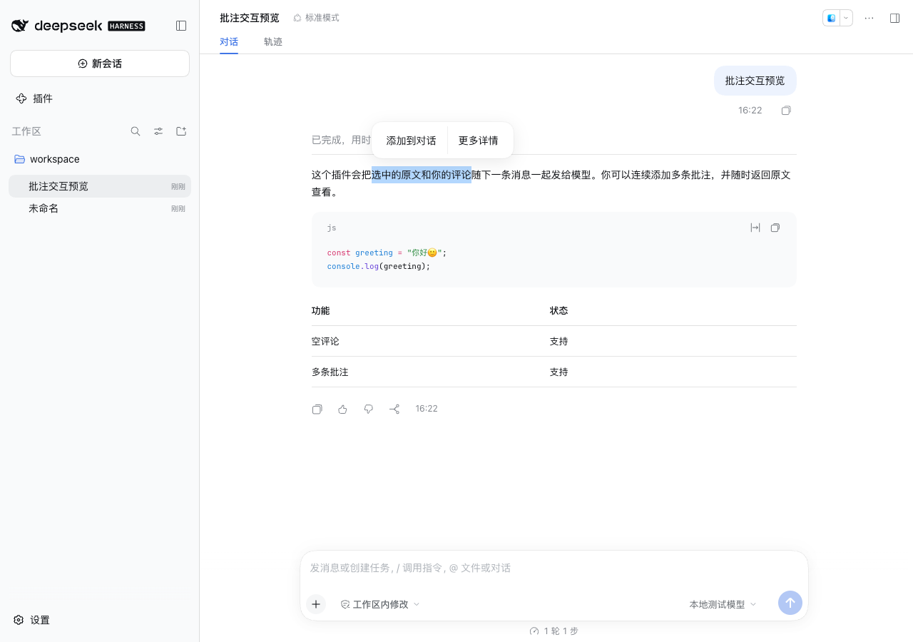
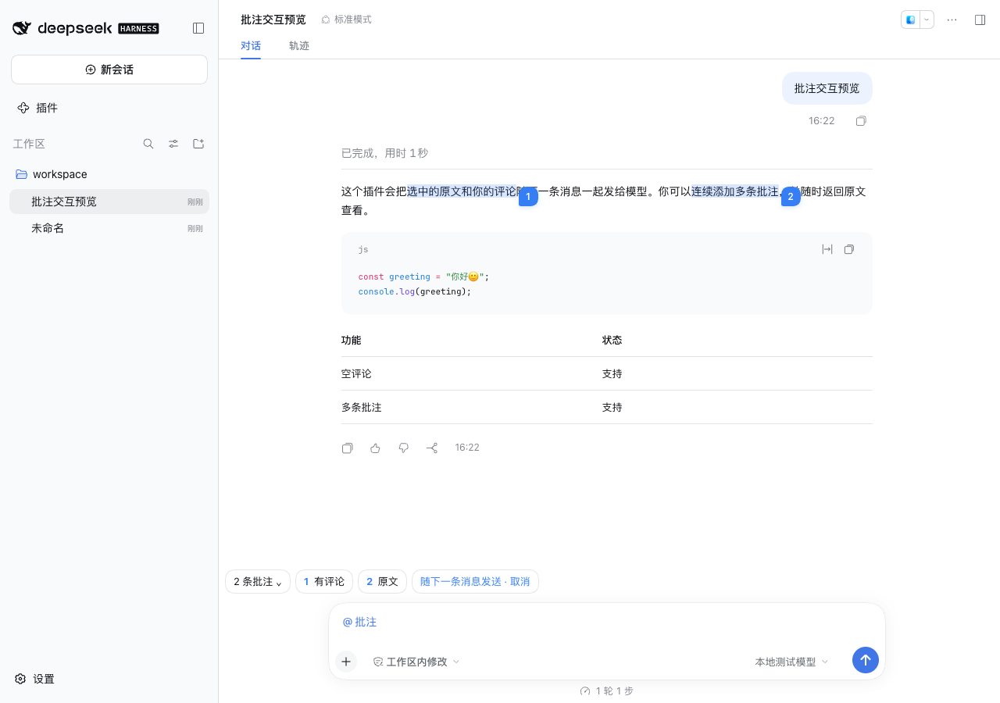

# 首版验证记录

日期：2026-10-08。版本：0.1.0。宿主：macOS DeepSeek Harness 0.2.0-rc.2 的 Web 客户端；浏览器：Chrome。本地固定回复模型，未调用真实模型服务。测试使用独立的临时配置、会话和浏览器，不写入日常 DSH 配置。

## 已通过

9 项数据与状态测试覆盖：空评论、Unicode/多行/定界符往返、大选区和长评论不截断、普通文字不被误当作协议、刷新恢复及稳定编号、会话隔离、仅确认已接受的原始批次、发送中编辑不被旧确认清除、勾选行为、存储失败不发布假状态、歧义原文不猜测定位。

真实宿主流程覆盖以下检查，并核对本地模型适配器实际收到的消息：

| 场景 | 结果 |
| --- | --- |
| 选区菜单与「更多详情」 | 显示完整引用 |
| 原文旁的可选评论 | 有评论和空评论都能保存 |
| 多条批注 | 保留独立蓝色编号 |
| 页面刷新 | 编号、评论、原生批注引用均恢复 |
| 主输入框中文和英文 | 正常输入，要求正文进入模型 |
| 原生 Enter 和发送按钮 | 批注资料通过原生发送流程进入模型 |
| 已接受消息 | 清空对应待发送状态，呈现批注胶囊 |
| 已发送批注 | 查看完整原文与评论、提供原文定位 |
| 多行代码 | 保留换行、中文和 emoji |
| 深色主题、480px 窄窗口 | 编号正常，编辑器不溢出视口 |
| 取消附加、重新附加 | 保留草稿正文，取消后输入不会自行附加 |
| 未勾选批注 | 正常消息独立发送，批注保留 |
| 原生图片与文本文件 | 两类附件与批注同时进入模型 |
| 切换会话 | 另一个会话不出现批注，返回原会话恢复 |
| 发送前序列化失败 | 原生输入框恢复要求和引用，批注仍待发送 |
| 失败后重试 | 已接受后才移除待发送状态 |

正常流程没有页面异常或控制台错误。语音功能未实现。

安装包也已通过原生 `dsh plugin ... add` 在独立配置中安装，确认包依赖和插件 bundle 均进入宿主配置。

## 证据与复现

运行 `npm run test:host` 后，`artifacts/verification.json` 记录检查列表和实际用户消息，`artifacts/model-request.json` 记录模型收到的完整消息，`artifacts/host.log` 记录隔离测试宿主启动结果。截图位于同一目录。原始证据保持完整；目录不进入 Git 或安装包。

## 仍需后续使用验证

真实模型对批注的处理效果取决于模型；本地测试确认发送资料完整。尚未覆盖其他 DSH 版本、不同选区插件同时启用、桌面原生 WebView 的手工操作、多个标签页并发编辑同一会话、真实输入法的硬件组合输入，以及超长历史的自动加载定位。

这不是对 Codex 全部行为一致性的声明。实现以用户截图中的选区菜单、可选评论浮层、蓝色编号和发送入口为基准。
