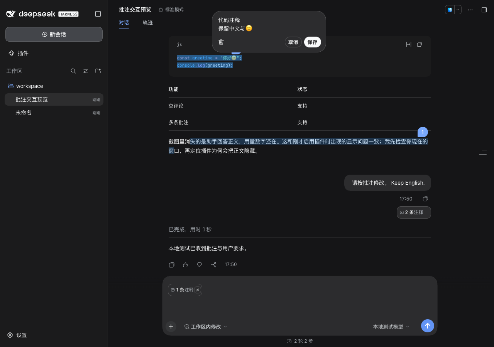

# 验证记录

日期：2026-10-08。版本：0.2.5。宿主：macOS DeepSeek Harness 0.2.0-rc.2 的 Web 客户端；浏览器：Chrome。本地固定回复模型，未调用真实模型服务。测试使用独立的临时配置、会话和浏览器，不写入日常 DSH 配置。

## 已通过

11 项数据与状态测试覆盖：空评论、Unicode/多行/定界符往返、大选区和长评论不截断、普通文字不被误当作协议、刷新恢复与最小空缺编号复用、保留其他及已发送批注编号、迟到确认不误清除复用编号的新批注、批量移除保留已发送记录并使旧引用失效、会话隔离、仅确认已接受的原始批次、发送中编辑不被旧确认清除、勾选行为、存储失败不发布假状态、歧义原文不猜测定位。

真实宿主流程覆盖以下检查，并核对本地模型适配器实际收到的消息：

| 场景 | 结果 |
| --- | --- |
| 选区菜单与「更多详情」 | 显示完整引用 |
| 原文旁的可选评论 | 紧凑输入与展开编辑均可用；有评论和空评论都能保存 |
| 取消、保存、删除 | 取消保留原值；保存才提交修改；编辑器及详情卡删除均移除编号 |
| 输入框详情卡 | 完整引用、评论、铅笔编辑和删除；位于原生输入框内部 |
| 已渲染会话中启用插件 | 正文正常显示；保留原生渲染器注册及缓存 |
| 思考/正文分离的会话 | 只有正文处理批注定位，折叠思考区不重复误报原文变化 |
| 多条批注 | 保留独立蓝色编号 |
| 页面刷新 | 编号、评论、原生批注引用均恢复 |
| 主输入框中文和英文 | 正常输入，要求正文进入模型 |
| 原生 Enter 和发送按钮 | 批注资料通过原生发送流程进入模型 |
| 已接受消息 | 清空对应待发送状态，呈现批注胶囊 |
| 已发送批注 | 查看完整原文与评论、提供原文定位 |
| 长回答中的原文跳转 | 对 40 段长回答中的具体选区定位；收起浮层，仅高亮原文；选区和编号位于顶部栏与输入框之间 |
| 高输入框与长评论 | 保留 8 行原生输入草稿；展开 12 行评论时为编辑器重新预留空间 |
| 窄窗口跳转与编辑 | 480px 宽度下查看跳转不留浮层；编辑框不遮挡蓝色编号，编号可直接命中 |
| 胶囊点击与悬停 | 待发送与已发送胶囊悬停显示详情；点击直接定位、高亮原文并关闭详情；跨越胶囊与卡片间隙后仍能点击编辑和删除 |
| 胶囊默认态与悬停态样式 | 默认态文字完整、关闭按钮隐藏；悬停文字保持原生主要文字色，20px 关闭按钮显示圆形曲线 |
| 多行代码 | 保留换行、中文和 emoji |
| 深色主题、480px 窄窗口 | 评论框采用深色背景，编辑器不溢出视口 |
| 三态及编号 | 紧凑框 296×46、展开框 296×86、同文详情卡 384×143、胶囊 89×32、编号 27×27；Chrome 2x 截图验证 |
| 胶囊与详情卡 | 胶囊位于原生输入框内部；详情卡与胶囊左侧对齐 |
| 多行代码的编号 | 位于选区上方，原生代码栏不拦截点击 |
| × 一次移除 | 无确认框；待发送批注、编号、高亮和原生引用消失，聊天文字、文件及已发送批注保留；刷新后已移除批注不恢复 |
| 旧版取消附加状态升级 | 保留现有批注和序号；重新加载后原生发送引用恢复，界面不提供回形针重新附加按钮 |
| 删除后序号复用 | 删除后再次新增使用空缺编号；刷新兼容旧版递增计数器；已发送编号继续保留 |
| 未勾选批注 | 正常消息独立发送，批注保留 |
| 原生图片与文本文件 | 两类附件与批注同时进入模型 |
| 切换会话 | 另一个会话不出现批注，返回原会话恢复 |
| 发送前序列化失败 | 原生输入框恢复要求和引用，批注仍待发送 |
| 失败后重试 | 已接受后才移除待发送状态 |

正常流程没有页面异常或控制台错误。语音功能未实现。

安装包也已通过原生 `dsh plugin ... add` 在独立配置中安装，确认包依赖和插件 bundle 均进入宿主配置。

## 证据与复现

运行 `npm run test:host` 后，`artifacts/verification.json` 记录检查列表和实际用户消息，`artifacts/model-request.json` 记录模型收到的完整消息，`artifacts/host.log` 记录隔离测试宿主启动结果。截图位于同一目录。新增 `artifacts/ui-measurements.json` 记录真实控件的尺寸、位置、圆角、字体、主题色和阴影；`pixel-*@2x.png` 保留 Chrome DPR=2 的实际控件截图。原始证据保持完整；目录不进入 Git 或安装包。

## 仍需后续使用验证

真实模型对批注的处理效果取决于模型；本地测试确认发送资料完整。桌面更新后的手工检查另记于本地安装回执。尚未覆盖其他 DSH 版本、不同选区插件同时启用、多个标签页并发编辑同一会话、真实输入法的硬件组合输入，以及超长历史的自动加载定位。

这不是对 Codex 全部行为一致性的声明。实现以用户截图中的选区菜单、可选评论浮层、蓝色编号和发送入口为基准。
